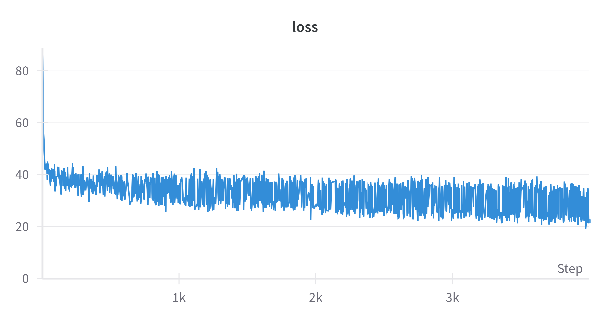
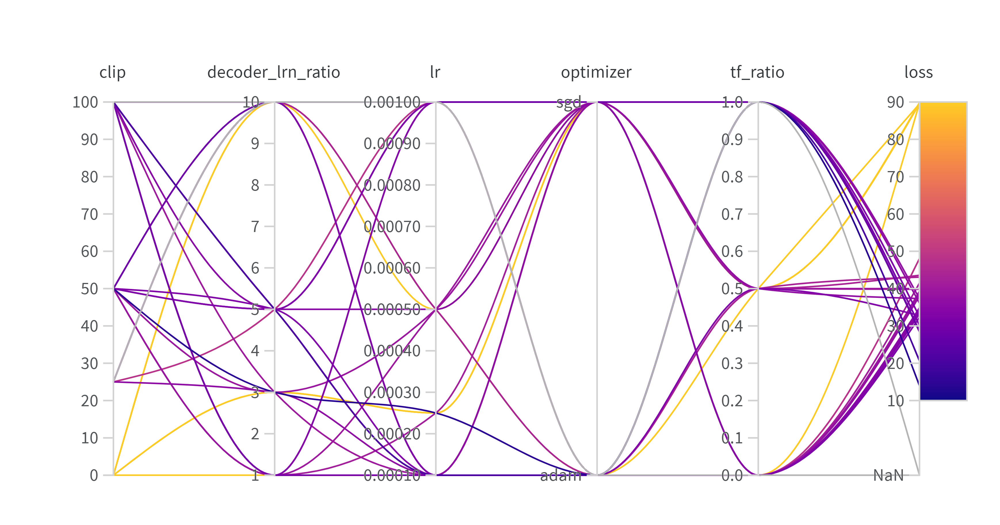

# ChatBot

## Introduction
This project involves training a simple chatbot using movie scripts from the Cornell Movie Dialogs Corpus based on the PyTorch Chatbot Tutorial. The chatbot is implemented using a sequence-to-sequence model with Luong attention mechanism(s). The goal is to create an interactive chatbot that can engage in a meaningful conversation with users.

## Prerequisites
To run this project, you will need the following:
- Python 3.x
- PyTorch
- NumPy
- Matplotlib
- Weights and Biases (W&B)

## Methodology
The project consists of two main parts:

### Part 1: Training a Simple Chatbot
- Data Preparation: The chatbot is trained using the Cornell Movie Dialogs Corpus. The data is preprocessed and prepared for training.
- Model Implementation: Implementation of a sequence-to-sequence model with Luong attention mechanism(s).
- Training and Evaluation: Training and evaluation of the model using mini-batches.
- Decoding Module: Implementation of greedy-search decoding module.
- Interaction: Interaction with the trained chatbot.
- Hyperparameter Tuning: Use of Weights and Biases (W&B) for hyperparameter tuning.
- Profiling: Profiling of the model using PyTorch Profiler to measure the time and memory consumption.

### Part 2: Transitioning to TorchScript
- TorchScript Conversion: Explanation of differences between tracing and scripting in TorchScript and conversion of the trained model to TorchScript.
- Model Evaluation: Evaluation of the TorchScript model.
- Latency Comparison: Comparison of evaluation latency between the TorchScripted model and the original PyTorch model.

## Results and Observations
- The best hyperparameters were found using W&B hyperparameter tuning, resulting in a minimum loss for the trained model.

- The hyperparameters that significantly impacted the model's convergence were gradient clipping (clip), teacher forcing ratio (tf_ratio), and learning rate (lr).

- Profiling of the model showed the time and memory consumption of the selected model’s operators.
- The transition to TorchScript showed a significant improvement in performance on GPU, with the TorchScript model running approximately 1.93 times faster than the original PyTorch model.

## How to Run and Use the Code
1. Clone this repository.
2. Install the required dependencies.
3. Run the Jupyter notebook `ChatBot.ipynb` to train and evaluate the chatbot model.
4. For hyperparameter tuning, follow the instructions in the notebook to set up and run a sweep using W&B.
5. To convert the trained model to TorchScript and evaluate its performance, follow the instructions in the notebook.

## References
- [PyTorch Chatbot Tutorial](https://pytorch.org/tutorials/beginner/chatbot_tutorial.html)
- [Cornell Movie Dialogs Corpus](https://www.cs.cornell.edu/~cristian/Cornell_Movie-Dialogs_Corpus.html)
- [Weights and Biases Website](https://wandb.ai/site)
- [PyTorch Profiler Example](https://pytorch.org/tutorials/recipes/recipes/profiler_recipe.html)
- [PyTorch JIT and TorchScript](https://towardsdatascience.com/pytorch-jit-and-torchscript-c2a77bac0fff)

Thank you for exploring this repository!
